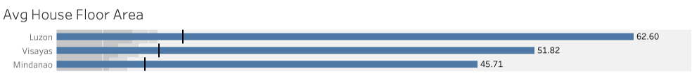
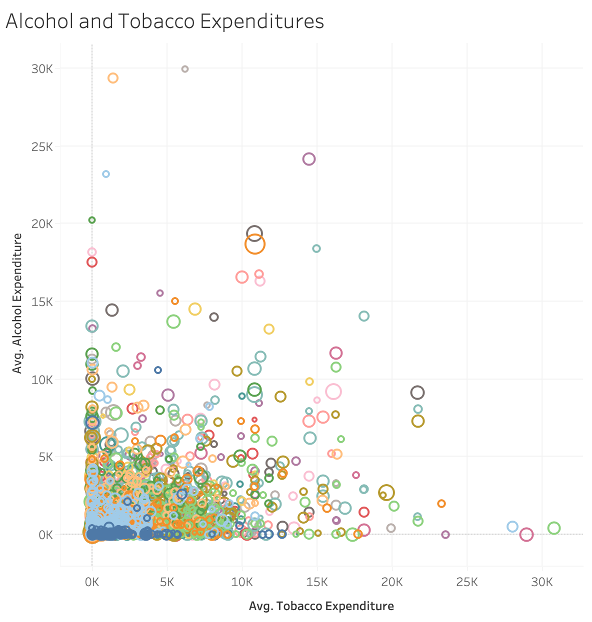
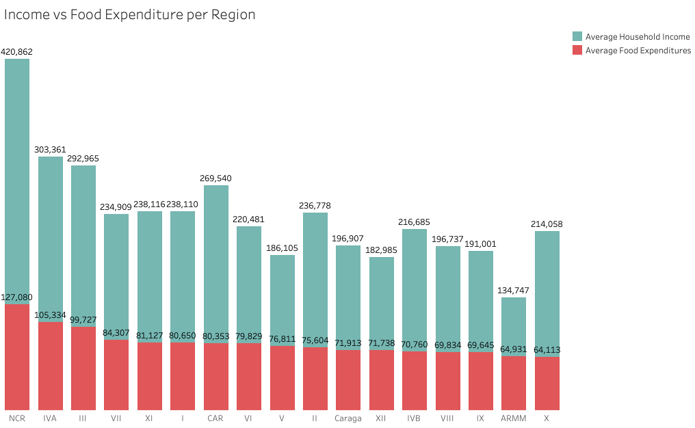
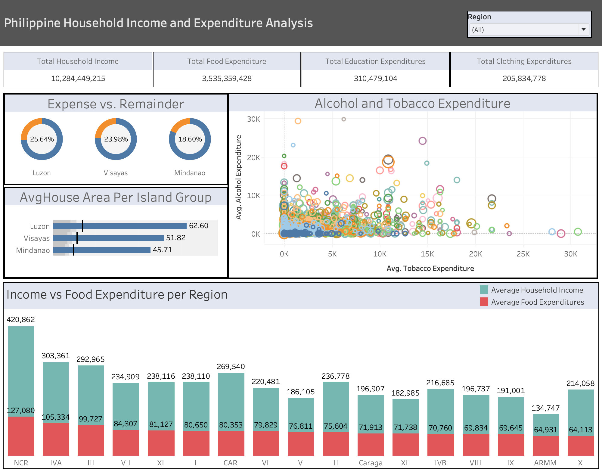

# Philippine Household Income and Expenditure Analysis Dashboard

This project visualizes the Philippine Family Income and Expenditure data using Tableau. The dashboard offers a comprehensive view of how household income is distributed across various expenditure categories, including food, education, and other essentials. By examining the data, we can uncover significant insights into the financial behavior of households throughout the country.

Additionally, the dashboard highlights regional disparities in income, housing size, and consumption patterns among the three major island groups: Luzon, Visayas, and Mindanao. These differences shed light on the socioeconomic challenges faced by each region, providing a deeper understanding of how income levels and spending habits vary across the Philippines.

## Overview

The objective of this project is to analyze the relationship between household income and various types of expenditures, including food, education, clothing, alcohol, and tobacco. The analysis is broken down by region and island group, with a particular focus on key disparities in savings capacity and household space.

The dataset for this project comes from Kaggle - <a href="https://www.kaggle.com/datasets/grosvenpaul/family-income-and-expenditure/data/">Family Income and Expenditure</a>.

## Dashboard Features

### Total Income vs. Expenditure (Regional Overview)

• Visualization Type: Pie Chart
  
• Description: This chart compares total household income to expenditure for the major island groups.

• Key Insight: Mindanao shows the smallest income remainder, retaining only 18.60% of total income, indicating limited capacity for savings in that region compared to Luzon and Visayas.

• Callout Insight: "Families in Mindanao retain only 18.6% of their income after expenditures."

### Average House Area Per Island Group

• Visualization Type: Horizontal Bar Chart
  
• Description: This chart depicts the average house area per island group, with a focus on housing size disparities across Luzon, Visayas, and Mindanao.

• Key Insight: Mindanao has the smallest average house area at 45.71 sq. m, with an average of 9.591 sq. m per person.

• Callout Insight: "Mindanao’s average house area is significantly smaller than Luzon and Visayas."

### Alcohol and Tobacco Expenditure by Household Head Occupation

• Visualization Type: Scatter Plot
  
• Description: This chart visualizes the correlation between household head occupations and their alcohol and tobacco expenditures.

• Key Insights: Single General Managers in Region VIII have the highest alcohol expenditure at ₱29,900 per year while Divorced Technical and Commercial Sales Representatives from Region III spend the most on tobacco.

• Callout Insight: "Region VIII’s Single General Managers spend the most on alcohol, while Region III's divorced sales representatives lead in tobacco expenditure."

### Income vs. Food Expenditure Per Region

• Visualization Type: Stacked Bar Chart
  
• Description: This chart compares household income and food expenditure across different regions in the Philippines.

• Key Insights: NCR (National Capital Region) has the highest average income at ₱420,862, while ARMM (Autonomous Region in Muslim Mindanao) has the lowest at ₱134,747.

• Callout Insight: "NCR boasts the highest household income, while ARMM struggles with the lowest income levels."

## Key Insights and Conclusions

• Families in Mindanao face financial strain, with only 18.60% of income left after expenses, leading to limited savings capacity.
  
• Mindanao also has smaller homes on average, indicating possible socioeconomic disparities in housing compared to Luzon and Visayas.

• Occupation strongly influences alcohol and tobacco expenditure, with certain regions and occupations leading in these categories.

• Regional disparities are evident, with NCR having the highest income levels and ARMM having the lowest, highlighting economic inequalities across the country.

## Project Insights

This project provides a comprehensive analysis of income and expenditure patterns across the Philippines, revealing how economic factors vary across regions and occupations. Through visualizing this data, we uncover significant insights into the financial landscape of the country, focusing on income distribution, consumption habits, and regional disparities.

